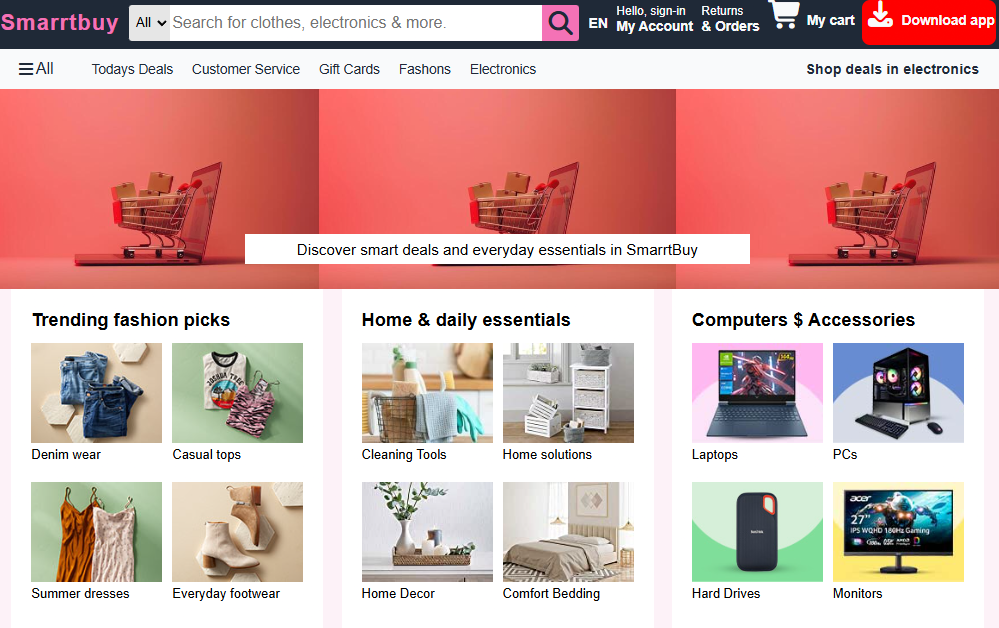
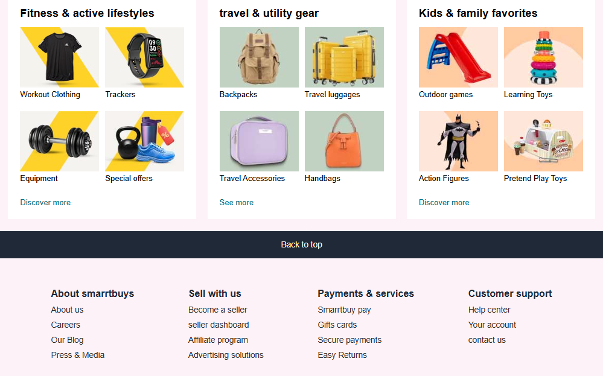

# Smarrtbuy 🛍️

Smarrtbuy is a **e-commerce homepage UI** built using **HTML5** and **CSS3**.  
This project focuses on creating a clean, user-friendly shopping interface inspired by real-world e-commerce platforms.

---

## 📸 Project Preview

---

## ✨ Features
- Clean and modern navigation bar
- Search bar with category selector
- Product category cards layout
- Hero banner section
- Footer with multiple informational sections
- Simple and consistent UI design

---

## 🛠 Tech Stack
- HTML5
- CSS3
- Font Awesome

---

## 📚 What I Learned
- Structuring real-world frontend layouts
- Inspect a website
- Using Flexbox for alignment and responsiveness
- Writing clean and reusable CSS
- Organizing project files properly
- Creating professional GitHub documentation

---

## 🚀 Future Improvements
- Add JavaScript functionality (search, cart interactions)
- Improve mobile responsiveness
- Add product detail pages
- Implement dark mode

---

## 👤 Author
**Aditya**  
BCA Student  
Aspiring Frontend / Full Stack Developer

---

## 📬 Contact
- **GitHub:** https://github.com/adityabelgundkar33-prog  
- **Email:** adityabelgundkar33@gmail.com  

---

## ⭐ Support
If you like this project, consider giving it a ⭐ on GitHub!
